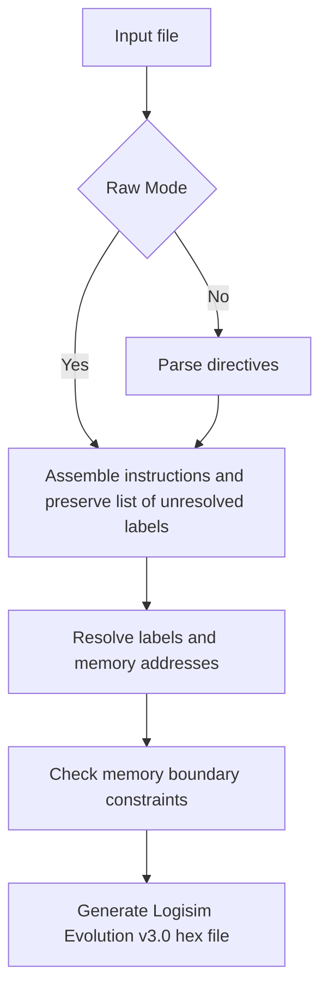

# Rochoyita / রচয়িতা

Rochoyita is a rudimentary assembler written for Sutra-1.

## Features

- Preprocessor directives
    - `#define <MACRO> <VALUE>`
    - `#undef`
    - `#include "<file path>"`
    - `#ifdef <MACRO>`
    - `#ifndef <MACRO>`
    - `#else`
    - `#endif`
- Comments
    - Single line: `// ...`
    - Multi line: `/* .. */`
- Labels (with both ahead/before declarations)
- Raw mode which disables pre processor. It is automatically enabled when `.s` file is encountered on non Windows Systems or `--raw` is explicitly passed in arguments.
- [Pseudo instructions](https://github.com/rnayabed/sutra-1/blob/master/docs/ISA.md#Pseudo_Instructions)

## High-level flowchart

